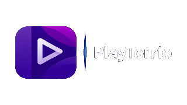

<div align="center">

  

  <p>
    An open-source media and streaming app built specifically for Android TV.
    <br />
    Connect your Stremio addons, Debrid accounts, audiobooks, and music in one clean interface.
  </p>

  <p>
    <a href="https://github.com/PlayTorrioMedia/PlayTorrioTV/releases/latest">Download APK</a> ·
    <a href="https://playtorrio.tv">Website</a>
  </p>

</div>

---

## What is PlayTorrio TV?

PlayTorrio TV is a media hub tailored for Android TV and TV boxes. Instead of jumping between different apps for movies, series, audiobooks, and music, PlayTorrio brings your sources together with remote-friendly navigation and fast playback.

## Features

- **Built for TV Remotes**
  Native Android TV interface built with Jetpack Compose TV and Material 3. Smooth D-pad navigation, clear focus indicators, and fast performance on TV hardware.

- **Stremio Addon Support**
  Install and sync Stremio addons. Browse addon catalogs, search across providers, and stream movies and series with full metadata.

- **Direct Debrid Integration**
  Log in with your API key for instant playback through:
  - Torbox
  - Real-Debrid
  - Premiumize
  - AllDebrid
  - Debrid-Link

  Cached streams play immediately without buffering. Uncached torrents are added directly to your Debrid cloud library.

- **Built-in Torrent Engine (TorrServer)**
  Stream torrents directly without needing external apps. Includes an explicit P2P consent prompt to ensure you never accidentally expose your IP address if Debrid isn't configured.

- **PlayTorrioHTTP Built-in Source**
  Includes a built-in direct HTTP scraper engine with automatic link verification to filter out dead streams before playback.

- **Audiobooks**
  A dedicated audiobooks hub featuring:
  - AudiobookBay source scraping
  - Debrid cloud streaming (Torbox, Real-Debrid, etc.) or optional P2P
  - Full chapter list with jump-to-chapter
  - Separate "Continue Listening" shelf isolated from your video progress
  - Saved playback positions and playback speed controls (0.75x - 2.0x)

- **Music**
  Integrated music section with search, up-next queue, album artwork, and background audio playback.

- **Advanced TV Player (Media3 / ExoPlayer)**
  - Multi-audio track & audio pass-through support
  - Subtitles with language selection and Stremio subtitle addon support
  - Intro skipping via IntroDB
  - Auto-play next episode and binge-watching support
  - Resume playback across app restarts

- **Sync & Metadata**
  - Trakt scrobbling and watchlist synchronization
  - IMDb ratings and TMDB metadata

## Installation

Download the latest release APK from the [Releases](https://github.com/PlayTorrioMedia/PlayTorrioTV/releases/latest) page and install it on your Android TV or TV box via ADB or a file manager app like Downloader.

```bash
adb install app-full-arm64-v8a-release.apk
```

## Building from Source

Requirements:
- Android Studio Ladybug or newer
- JDK 17+
- Android SDK (API 36, NDK 28)

```bash
git clone https://github.com/PlayTorrioMedia/PlayTorrioTV.git
cd PlayTorrioTV

# Debug build
./gradlew assembleFullDebug

# Release build
./gradlew assembleFullRelease
```

The output APKs will be located in `app/build/outputs/apk/full/`.

## License

This project is licensed under the [GNU General Public License v3.0](./LICENSE).
